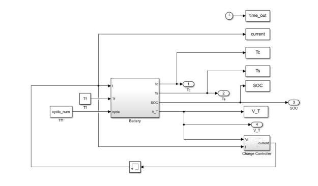
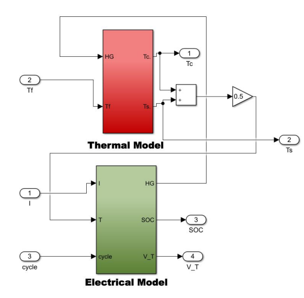

# Battery State of Health Estimation
This analysis compared results from a paper on battery state of health and attempted to replicate/simulate the outputs. Health metrics included discharge capacity, open circuit voltage, and thermal resistance to analyze the response over discharge cycles and calendar life. The results were outputted from a provided battery model in Simulink, and further postprocessing was done in Matlab.

[project presentation PDF link](state_of_health_estimation_presentation.pdf)

### Simulink Model Diagrams

